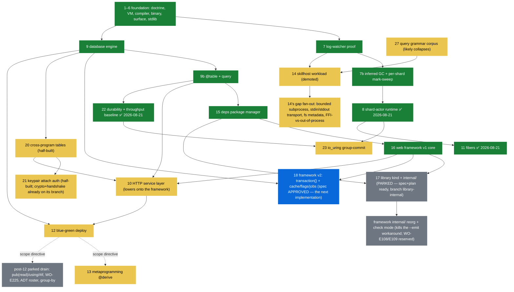
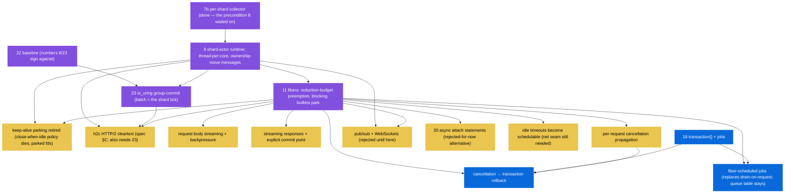
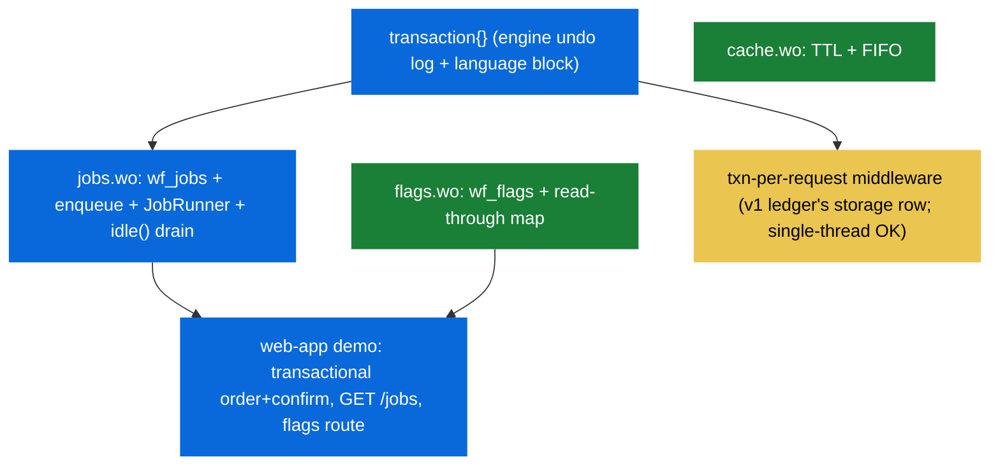

# Dependency graphs — iterations and framework features

> Companion to [00-status.md](stories/00-status.md) (states live THERE; this page
> carries the edges). An arrow `A --> B` means **A must exist before B**;
> a dashed arrow is a scope DIRECTIVE, not a technical dependency. Use it
> to pick the next implementation: anything whose incoming arrows are all
> green is startable today. Rebuilt 2026-08-20 from a sweep of every
> story/spec/plan markdown (the "misses" pass: iteration 17's outgoing
> edges, the concurrency chain, the post-12 parked drain, 9b→10,
> 14's gap fan-out, 20's fiber caveat).

## 1. Story iterations

Reading it: **18 is the only spec-approved open node with all
prerequisites green — the next implementation.** After 18: 20/21 and 22
are startable (chosen order: 20/21 first — half-built branches rot).
17 unparks on directive: its prerequisites landed, its spec+plan wait on
branch `library-internal`, and its landing brings the framework reorg
node with it. 13 and the parked drain sit behind 12 by the 2026-08-08
scope directive (dashed), not by any technical edge.

## 2. The concurrency chain (iterations 8 / 23 / 11 and everything they gate)

The runtime's concurrency work is the single biggest unlocker — every
⏸ row in the framework ledger and two v2 follow-ons hang off it.

## 3. Framework v1 — remaining ledger items

Three gates recur: **net seams** (runtime `net` builtins), the **crypto
fork** (bitwise operators + hex literals landed with iteration 36, so
digests are now expressible in pure `.wo` — pure-`.wo` vs C-builtin is
story 34's brainstorm before the slice), and the
**concurrency chain above** (its gated nodes are not repeated here).

```mermaid
flowchart TD
    classDef gate fill:#8250df,color:#fff,stroke:none
    classDef ready fill:#1a7f37,color:#fff,stroke:none
    classDef blocked fill:#eac54f,color:#000,stroke:none
    classDef done fill:#6e7781,color:#fff,stroke:none

    CORS["CORS middleware ✅ slice 2"]:::done
    SECH["security-headers middleware ✅ slice 2"]:::done
    HOSTV["host validation (421) ✅ slice 2"]:::done
    STRICT["strict-parsing audit (dup Content-Length = 400) ✅ slice 2"]:::done
    WILD["wildcard segments *rest ✅ slice 2"]:::done
    PREC["precedence: registration order stands, wildcards last by construction ✅"]:::done
    GROUPS["route groups + group middleware ✅ slice 2"]:::done
    CTX["req.ctx bag ✅ slice 2"]:::done
    XFF["client_ip: X-Forwarded-For parsing ✅ slice 2 (peer VERIFY stays gated)"]:::done
    ACCEPT["accepts(): response-side negotiation ✅ slice 2"]:::done

    NETSEAM["GATE: net runtime seams (timeouts, unix socket, peer address) — story 35 owns"]:::gate
    TMOUT["read/write/idle timeouts"]:::blocked
    UNIX["unix socket binding"]:::blocked
    PEERV["trusted-proxy PEER verification"]:::blocked

    CRYPTO["GATE CLEARED: iteration 34 landed C builtins — sha1/sha256/hmac_sha256 (ids 85-87)"]:::done
    SHA["sha1/sha256/hmac_sha256 ✅ iteration 34; SHA-512/CRC32 wait for a consumer"]:::done
    ETAG["ETag + If-None-Match 304 ✅ slice 2"]:::done
    COOKIE["signed cookies"]:::ready
    CSRF["CSRF"]:::ready
    SESS["session integrity"]:::ready
    HOOKV["webhook verification"]:::ready
    JWT["JWT HS256 (HARD STOP after)"]:::ready

    RADIX["radix-tree routing"]:::blocked
    I9E3["GATE: router scan unmeasured — 22's harness landed but benched the DB, not the router; perf-targets entry first"]:::gate

    STORAGE["storage-integration rows: migrations (future story), eager loading + tenant roots (query-surface work, 9-series)"]:::blocked

    NETSEAM --> TMOUT
    NETSEAM --> UNIX
    NETSEAM --> PEERV
    CRYPTO --> SHA
    SHA --> ETAG
    SHA --> COOKIE
    SHA --> CSRF
    SHA --> SESS
    SHA --> HOOKV
    SHA --> JWT
    I9E3 --> RADIX
```

**Slice 2 landed (2026-08-23, branch `framework-v1b`):** every
formerly-green node plus the crypto chain's first consumers — CORS,
security headers, host validation (421), strict dup-Content-Length,
`*rest` wildcards, route groups + group middleware, `req.ctx`,
`client_ip`, `accepts()`, ETag/304 — all gated by `just web-app`
(38 checks). The after-middleware seam (`After`/`use_after`) carries
the response-header half. Now READY with the digest builtins landed:
signed cookies, CSRF, session integrity, webhook verification, JWT
HS256 (the hard stop). Still gated: timeouts/unix-socket/peer-verify
(story 35's net seams) and the radix tree (router scan unmeasured).
Note: 21's keypair crypto is its own C implementation (already on
branch `keypair-auth`) — it neither waits for nor feeds this chain.

## 4. Framework v2 (iteration 18) — internal order

Cache and flags are dependency-free warm-ups; `transaction { }` is the
critical path (the only engine + language work); jobs compose on it; the
demo and gate close it. Fiber-scheduled jobs and cancellation→rollback
appear in graph 2 — they need iteration 11 as well as 18.

## Maintenance rule

When an iteration or slice lands, update its node's class here in the
same change that moves the board row — the two documents answer
different questions (status vs. edges) and drift kills both.
