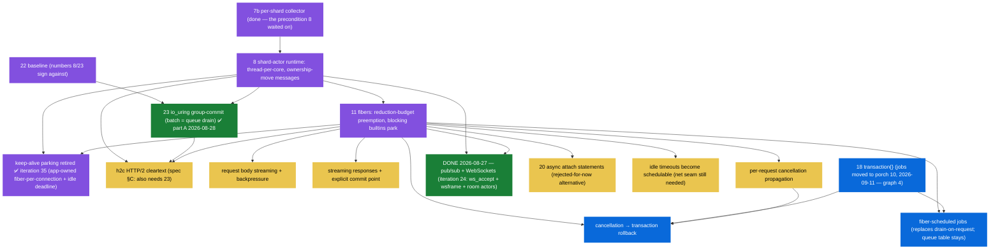
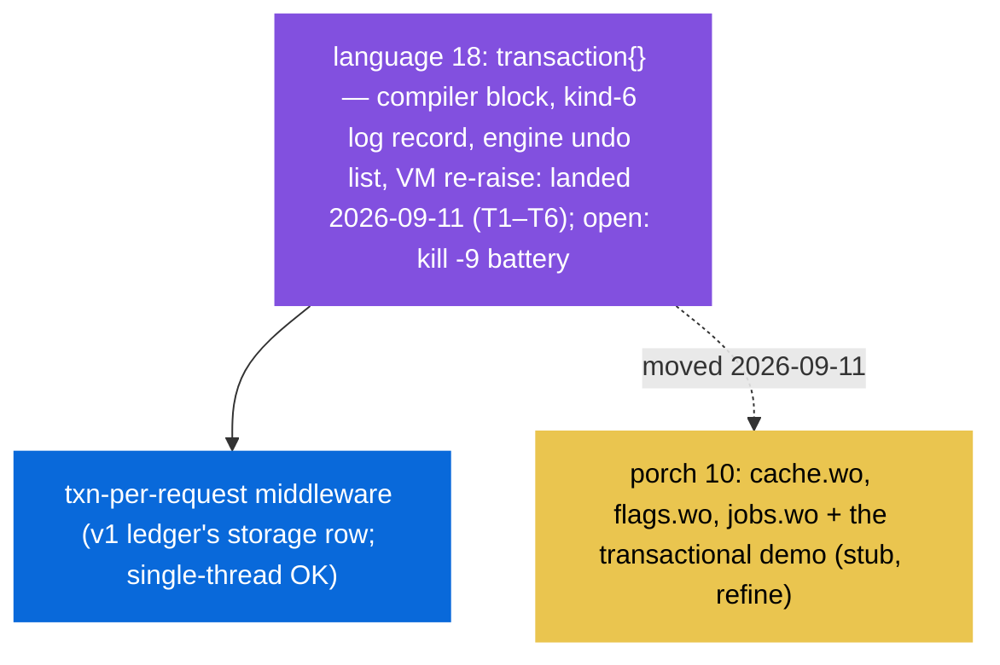
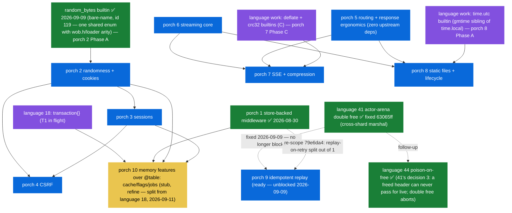
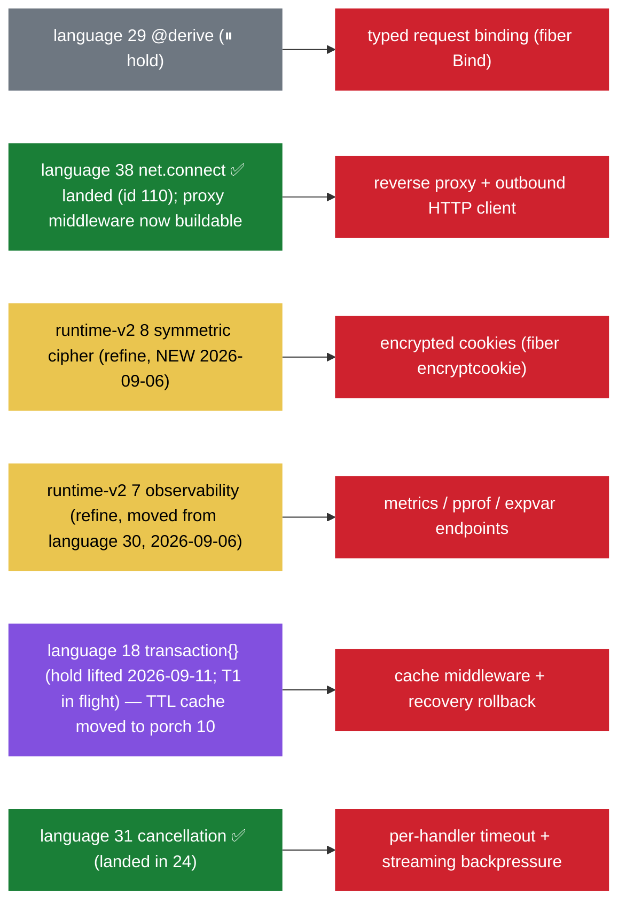
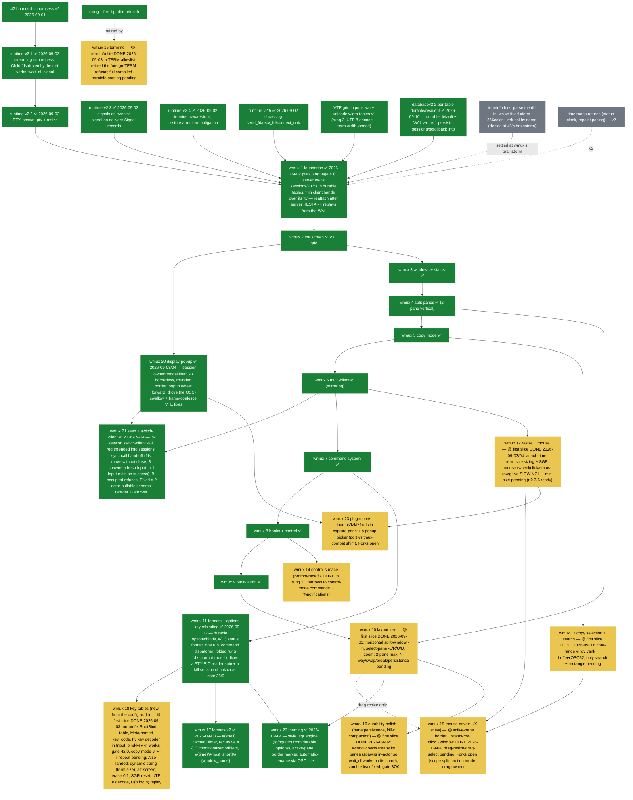
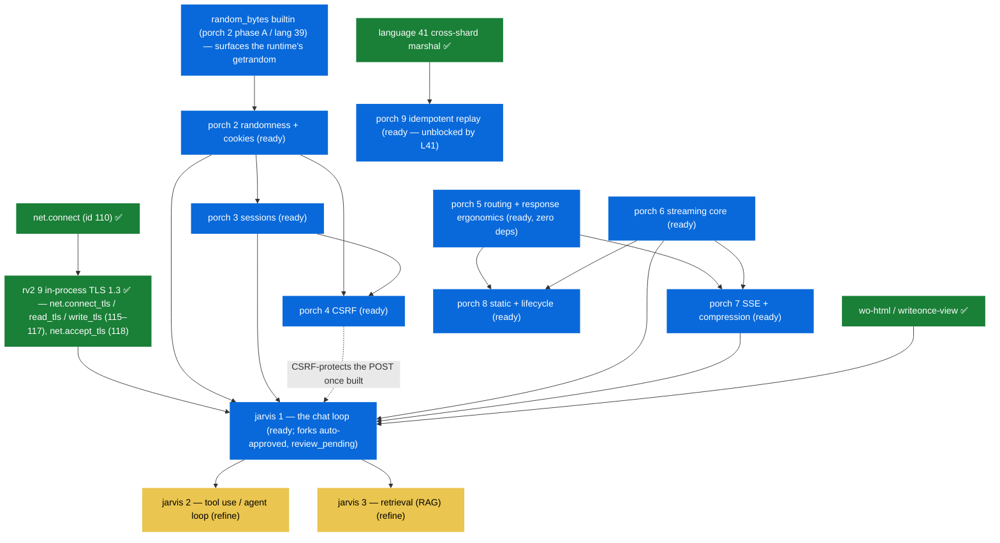
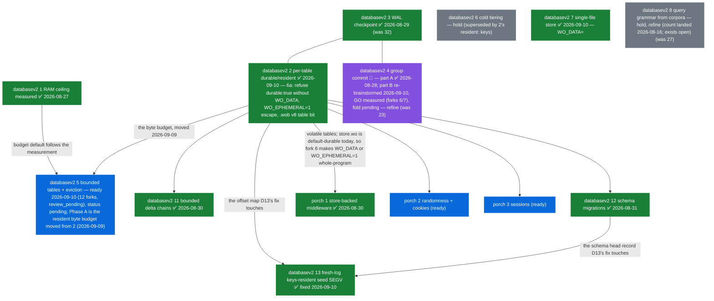

# Dependency graphs — iterations and framework features

> Companion to [00-status.md](stories/00-status.md) (states live THERE; this page
> carries the edges). An arrow `A --> B` means **A must exist before B**;
> a dashed arrow is a scope DIRECTIVE, not a technical dependency. Use it
> to pick the next implementation: anything whose incoming arrows are all
> green is startable today. Rebuilt 2026-08-20 from a sweep of every
> story/spec/plan markdown (the "misses" pass: iteration 17's outgoing
> edges, the concurrency chain, the parked drain, 9b→25, 28's gap
> fan-out, 20's fiber caveat), and **refreshed 2026-08-26** against the
> code and the story frontmatter: graph 1 had drifted a generation
> behind — it still showed 17 parked and 18 as next, and it used the
> pre-renumber ids 10/12/13/14 for what are now stories 25/26/29/28. All
> iterations through 38 are now nodes.

## 1. Story iterations

```mermaid
flowchart TD
    classDef done fill:#1a7f37,color:#fff,stroke:none
    classDef parked fill:#6e7781,color:#fff,stroke:none
    classDef specd fill:#0969da,color:#fff,stroke:none
    classDef open fill:#eac54f,color:#000,stroke:none
    classDef inprog fill:#8250df,color:#fff,stroke:none

    FOUND["1–6 foundation: doctrine, VM, compiler, binary, surface, stdlib"]:::done
    I7["7 log-watcher proof"]:::done
    I7b["7b inferred GC + per-shard mark-sweep"]:::done
    I9["9 database engine"]:::done
    I9b["9b @table + query"]:::done
    I15["15 deps package manager"]:::done
    I16["16 web framework v1 core"]:::done

    I17["17 library kind + internal/ ✅ 2026-08-20"]:::done
    FWREORG["framework internal/ reorg + check mode ✅ landed with 17 (WO-E108/E109 shipped)"]:::done
    I19["19 Float + Bytes ✅ 2026-08-20"]:::done
    I37["37 wo-html components + raw text literal ✅ 2026-08-25"]:::done
    I35["35 net runtime seams ✅ 2026-08-23"]:::done
    I36["36 operator parity: not/bitwise/hex literals — code landed 2026-08-22, awaiting the manual pass"]:::specd
    RELEASE["packaging + release pipeline ✅ 2026-08-25 (no story: VERSION, just dist, install-accept, release.yml)"]:::done

    I18["18 transaction{} 🔄 hold lifted + split 2026-09-11 (cache/flags/jobs → porch 10, graph 4); T1–T6, T8, T9 landed same day, corpus green; open: kill -9 battery (T7)"]:::inprog

    I9c["20 cross-program tables (⏸ hold 2026-08-21; channel half-built)"]:::parked
    I9d["21 keypair attach auth (⏸ hold 2026-08-21; crypto floor now exists via 34)"]:::parked
    I9e["22 durability + throughput baseline ✅ 2026-08-21"]:::done
    I8["8 shard-actor runtime ✅ 2026-08-21"]:::done
    I24["24 chat + actor lifecycle 🔄 THE LIVE SLICE (absorbing 31 + 34)"]:::specd
    I34["34 crypto builtins ✅ code landed as 24's T1 (ids 85-87)"]:::done
    I31["31 actor lifecycle — call/mailbox-cap/death landed in 24; monitor + time.after (ids 89/90) open"]:::specd
    I9f["23 io_uring group-commit ✅ part A 2026-08-28 as databasev2 4 (part B refine)"]:::done
    I32["32 WAL checkpoint ✅ 2026-08-29 as databasev2 3 (compaction by rewrite + rename)"]:::done
    I33["33 single-file store WO_DATA=<path>.db (driver-only, off-chain)"]:::open
    I25["25 HTTP service layer — `service` blocks (⏸ hold 2026-08-21; story file removed, plan remains)"]:::parked
    I11["11 fibers ✅ 2026-08-21"]:::done
    I26["26 blue-green deploy (⏸ hold)"]:::parked
    I29["29 metaprogramming @derive (⏸ hold)"]:::parked
    I28["28 skillhost workload (⏸ hold; demoted)"]:::parked
    I38["38 content platform capabilities: fs mutation verbs + net.connect"]:::open
    I9g["27 query grammar corpus (⏸ hold; likely collapses)"]:::parked
    I30["30 observability, CI, fuzz — release-only CI exists; per-change gates + fuzz open (no story file)"]:::open
    GAPS["28's gap fan-out, what is LEFT of it: fs metadata, FFI-vs-out-of-process (bounded subprocess + stdio transport moved to 42)"]:::open
    I42["42 bounded subprocess ✅ 2026-09-01: proc.run bounded + parked (pidfd), proc.run_dl; streaming form deferred by name"]:::done
    DRAIN["parked drain, what is LEFT of it: WO-E225 roster, ADT roster, group-by aggregates"]:::parked

    FOUND --> I7
    FOUND --> I9
    I7 --> I7b
    I9 --> I9b
    I9b --> I15
    I15 --> I16
    I15 --> I17
    I16 --> I17
    I17 --> FWREORG
    I16 --> I37
    I19 --> I37
    I17 --> RELEASE
    I9 --> I18
    I16 --> I18
    I9 --> I9c
    I9c --> I9d
    I9c --> I25
    I9b --> I25
    I16 --> I25
    I9b --> I9e
    I7b --> I8
    I9e --> I9f
    I8 --> I9f
    I8 --> I11
    I19 --> I34
    I34 --> I24
    I8 --> I24
    I11 --> I24
    I35 --> I24
    I31 --- I24
    %% 23 and 32 compose on the WAL commit path; neither needs the other (databasev2 story, corrected 2026-08-29)
    I9f --- I32
    I32 --- I33
    I9 --> I26
    I25 --> I26
    I9g --> I28
    I7 --> I28
    I28 --> GAPS
    I11 --> I42
    I24 --> I42
    I16 --> I38
    I32 --> I38
    I36 -.reopens the pure-wo HMAC question.-> I34
    I26 -.scope directive.-> I29
    I26 -.scope directive.-> DRAIN
```

Reading it: **the live slice is 24** (chat + actor lifecycle, absorbing 31
and 34), and the chain behind it, 23 → 32, is done (databasev2 4 part A
2026-08-28, databasev2 3 2026-08-29). Everything else with all-green
incoming arrows is startable: **33** (driver-only, off-chain), **38** (the
fs-mutation and outbound-socket gaps), and **30**'s remaining half
(per-change CI and fuzzing — the release pipeline covered only publishing).
**36** needs no work, only the developer's manual pass over
`docs/examples/operators/`. The held tail — 20/21, 25, 26, 27, 28, 29 — (18's
hold lifted 2026-09-11, above) resumes on its own precedence notes; 29 and
what is left of the drain still
sit behind 26 by the 2026-08-08 scope directive (dashed), not by any
technical edge. Note what left the drain: `pub(read)`, `using` and `#if` all
shipped, so only the WO-E225/ADT rosters and group-by aggregates remain in
it.

## 2. The concurrency chain (iterations 8 / 23 / 11 and everything they gate)

The runtime's concurrency work is the single biggest unlocker — every
⏸ row in the framework ledger and two v2 follow-ons hang off it.

## 3. Framework v1 — remaining ledger items

Three gates recur: **net seams** (runtime `net` builtins), the **crypto
fork** (bitwise operators + hex literals landed with iteration 36, so
digests are now expressible in pure `.wo` — pure-`.wo` vs C-builtin is
story 34's brainstorm before the slice), and the
**concurrency chain above** (its gated nodes are not repeated here).

```mermaid
flowchart TD
    classDef gate fill:#8250df,color:#fff,stroke:none
    classDef ready fill:#1a7f37,color:#fff,stroke:none
    classDef blocked fill:#eac54f,color:#000,stroke:none
    classDef done fill:#6e7781,color:#fff,stroke:none

    CORS["CORS middleware ✅ slice 2"]:::done
    SECH["security-headers middleware ✅ slice 2"]:::done
    HOSTV["host validation (421) ✅ slice 2"]:::done
    STRICT["strict-parsing audit (dup Content-Length = 400) ✅ slice 2"]:::done
    WILD["wildcard segments *rest ✅ slice 2"]:::done
    PREC["precedence: registration order stands, wildcards last by construction ✅"]:::done
    GROUPS["route groups + group middleware ✅ slice 2"]:::done
    CTX["req.ctx bag ✅ slice 2"]:::done
    XFF["client_ip: X-Forwarded-For parsing ✅ slice 2 (peer VERIFY stays gated)"]:::done
    ACCEPT["accepts(): response-side negotiation ✅ slice 2"]:::done

    NETSEAM["GATE CLEARED: iteration 35 landed the net seams — _dl deadlines, listen_unix, peer (ids 91-95)"]:::done
    TMOUT["read/write/idle timeouts ✅ iteration 35 (serve_conn read_ms/idle_ms)"]:::done
    UNIX["unix socket binding ✅ iteration 35"]:::done
    PEERV["trusted-proxy PEER verification — net.peer landed; the verify middleware is a ready framework slice"]:::ready

    CRYPTO["GATE CLEARED: iteration 34 landed C builtins — sha1/sha256/hmac_sha256 (ids 85-87)"]:::done
    SHA["sha1/sha256/hmac_sha256 ✅ iteration 34; SHA-512/CRC32 wait for a consumer"]:::done
    ETAG["ETag + If-None-Match 304 ✅ slice 2"]:::done
    COOKIE["signed cookies"]:::ready
    CSRF["CSRF"]:::ready
    SESS["session integrity"]:::ready
    HOOKV["webhook verification"]:::ready
    JWT["JWT HS256 (HARD STOP after)"]:::ready

    RADIX["radix-tree routing"]:::blocked
    I9E3["GATE: router scan unmeasured — 22's harness landed but benched the DB, not the router; perf-targets entry first"]:::gate

    STORAGE["storage-integration rows: migrations (future story), eager loading + tenant roots (query-surface work, 9-series)"]:::blocked

    NETSEAM --> TMOUT
    NETSEAM --> UNIX
    NETSEAM --> PEERV
    CRYPTO --> SHA
    SHA --> ETAG
    SHA --> COOKIE
    SHA --> CSRF
    SHA --> SESS
    SHA --> HOOKV
    SHA --> JWT
    I9E3 --> RADIX
```

**Slice 2 landed (2026-08-23, branch `framework-v1b`):** every
formerly-green node plus the crypto chain's first consumers — CORS,
security headers, host validation (421), strict dup-Content-Length,
`*rest` wildcards, route groups + group middleware, `req.ctx`,
`client_ip`, `accepts()`, ETag/304 — all gated by `just web-app`
(38 checks). The after-middleware seam (`After`/`use_after`) carries
the response-header half. Now READY with the digest builtins landed:
signed cookies, CSRF, session integrity, webhook verification, JWT
HS256 (the hard stop). Still gated: timeouts/unix-socket/peer-verify
(story 35's net seams) and the radix tree (router scan unmeasured).
Note: 21's keypair crypto is its own C implementation (already on
branch `keypair-auth`) — it neither waits for nor feeds this chain.

## 4. Language 18 — `transaction { }` (was "Framework v2"; split 2026-09-11)

**Redrawn 2026-09-11.** The hold lifted (developer: "implement language 18")
and codd-shoney re-settled the scope: 18 is now the engine + language block
alone. `cache.wo`, `flags.wo`, `jobs.wo` and the transactional demo moved to
[porch 10](stories/porch/10-memory-features-over-table.md) (`refine`, stub),
which needs 18's `transaction { }` for its jobs demo and porch 1–3 otherwise.

`transaction { }` is the only engine + language work left in this iteration;
everything that only needed the WAL's staged batch as a `.wo` consumer moved
downstream to the track that owns `.wo` product code. Fiber-scheduled jobs and
cancellation→rollback appear in graph 2 — they need iteration 11 as well as 18.

## 5. porch — the web framework track

States live on [the board's porch section](stories/00-status.md). **The whole
track (2–8) is `readiness: ready`** as of the 2026-09-06 brainstorm; **1** is
done, **9** is held (blocked on the lang-41 arena hang, not an enhancement).
Three independent roots: **2** (the auth chain), **6** (the streaming chain),
**5** (anytime, no incoming edges at all — not even iteration 2). **10** is a
`refine` stub added 2026-09-11 (language 18's split — TTL cache, `@table`
feature flags, durable job queue) and is not part of the "whole track ready"
count.

This graph makes the **cross-track language edges** visible: the three builtins
the track needs, each drawn as a `lang` node feeding the story that owns it.

Edges corrected by the 2026-09-06 brainstorm: `P5 --> P7` (gzip's
`Accept-Encoding` reuses iteration 5's q-value ranking) stays, but the old
`P2 --> P7` edge is **gone** — story 7 decided `Vary` accumulates by comma-join
(iteration 5's shape), not iteration 2's repeated-header work. `P5 --> P8` is the
`Download`/`Attachment` helper. The three `lang` nodes are the track's entire
language bill; each is a builtin with a named consumer, none shipped as
decoration. **10** (added 2026-09-11) needs language 18's `transaction { }`
for its jobs demo and 1–3 for the store pattern, session-keyed cache and
flags read-through — see graph 4 for 18's own state.

## 5a. porch's language-driven gaps (out-of-scope features and the language stories that own them)

These are the features fiber ships that porch deliberately does **not** — each
excluded because a language primitive does not exist yet. Every edge points from
the owning language story to the porch feature it would unblock (see the
[porch↔fiber scope-gap analysis](plan/exploration/fiber/01-porch-vs-fiber-scope-gap.md)).

31 (cancellation) is already green — per-handler timeout and streaming
backpressure are unblocked at the language level and wait only on a porch slice
to consume them. The other five gaps are gated on an upstream story: two
brand-new runtime-v2 iterations (8 cipher, 7 observability — moved out of the
language track 2026-09-06), one language iteration on hold (29) and one
unheld and in flight (18, since 2026-09-11 — its TTL-cache half of `CACHE` now
lives in porch 10), one pending a spec (38). Landed enablers the
track already consumed — 34 (crypto digests), 36 (bit operators), 35 (net
seams) — are green in graphs 1–3 and not repeated here.

## 6. wmux — the multiplexer track (wmux 1) and its gap chain

The tmux study's gaps, remapped as buildable edges now that iteration 42
landed. Every yellow node is an iteration of the
[runtime-v2 track](stories/runtime-v2/00-story.md) ("the runtime beyond
sockets"), ALL `readiness: ready` since the track-wide brainstorm
([spec](superpowers/specs/2026-09-01-runtime-v2-design.md), 2026-09-01) —
[1 streaming subprocess](stories/runtime-v2/01-streaming-subprocess.md) ·
[2 PTY](stories/runtime-v2/02-pty.md) ·
[3 signals as events](stories/runtime-v2/03-signals-as-events.md) ·
[4 termios](stories/runtime-v2/04-termios.md) ·
[5 fd passing](stories/runtime-v2/05-fd-passing.md). wmux — its own
track, first of the softwares built with writeonce — is the driving
workload that consumes them all — [wmux 1](stories/wmux/01-wmux.md).

**The track landed whole on 2026-09-02** — every runtime edge into wmux
is green. The VTE grid + unicode-width node landed (rung 2), and the ladder
is now through rung 22 (see the wmux table on the board); rungs 10/12/13/15
have first slices, rung 23 (plugin ports + a tmux-compat CLI) remains the
big open item. Sibling reuse:
the alacritty Wayland stage reuses GFDPASS + GVTE; the zen CDP driver
now lacks only a WebSocket client; skillhost (28) has its stdin
transport. One edge added 2026-09-10: [databasev2 2](stories/databasev2/02-table-storage-modes.md) → wmux 1, drawn above as `DB2W`, because wmux 1 persists sessions/scrollback in durable `@table` classes and replays from the WAL on reattach — the dependency the prose already named without a node.

## 7. jarvis — the AI-assistant track and everything it waits on

The sixth track ([jarvis](stories/jarvis/00-story.md)): an AI assistant built in
writeonce. **The runtime side is done** — the whole outbound HTTPS path landed
2026-09-09 (runtime-v2 9, both directions, live-gated) and language 41 is fixed.
What jarvis 1 waits on now is purely the **framework**: the developer set the
order *porch first, then jarvis*. So this graph is the porch→jarvis chain.

**jarvis 1's dependency list, from the code and the stories (2026-09-09):**

| jarvis 1 needs | for | state |
| --- | --- | --- |
| `net.connect_tls` / `net.read_tls` / `net.write_tls` (runtime-v2 9) | dialing the LLM API over HTTPS, streaming its SSE reply | ✅ landed, live-gated |
| `net.connect` (id 110) | the TCP under it | ✅ landed |
| language 41 fix | actors carrying messages across shards without the double free | ✅ landed |
| `@table` | durable `Conversation` / `Message` history | ✅ exists |
| wo-html / writeonce-view | the chat page | ✅ exists |
| **porch 2** randomness + cookies (needs the `random_bytes` builtin first) | session id + signed cookie | ready, **unbuilt** |
| **porch 3** sessions | the session principal history is keyed to | ready, unbuilt (after 2) |
| **porch 6** streaming core | incremental response writes | ready, unbuilt |
| **porch 7** SSE + compression | token streaming to the browser | ready, unbuilt (after 5 + 6) |
| porch 4 CSRF | protecting `POST /message` (bearer-gated until then) | ready, unbuilt (after 2 + 3) |
| porch 5 routing + response ergonomics | the route surface | ready, unbuilt, zero deps |

**Build order that satisfies it** (the porch critical path to jarvis): the
`random_bytes` builtin → porch 2 → porch 3 → porch 5 → porch 6 → porch 7 (→ porch
4, 8, 9 to complete porch) → **jarvis 1**. Nothing on the runtime side is
outstanding; every remaining edge into jarvis 1 is a porch iteration.

## 8. databasev2 — the database beyond RAM

The third track ([databasev2](stories/databasev2/00-story.md)): what happens
when the data does not fit in memory. Its 3 and 4 are the language track's 32
and 23 renumbered — graph 1 still carries them as `I32`/`I9f`, green since
2026-08-29/28. Arrows point AT the iteration that needs the other, as in the
track's own ASCII graph; two edges are undirected: 3–4, which compose on the
WAL commit path and need each other in neither direction, and 2–3 (added
2026-09-10 — this graph had dropped it; the story's own graph always carried
it, [00-story.md:169-171](stories/databasev2/00-story.md)) — 2 needs 3's
offset map to survive compaction, and 3 has called 2's row API since task 5d,
so the coupling runs both ways. 9 and 10 (cross-program tables, keypair
attach) are held and not drawn.

Node D13, added 2026-09-10, fixed the same day: a defect found while smoking
databasev2 7, not that iteration's fault (it reproduced identically in the
pre-existing directory form). It needed 2 (the keys-resident offset map) and
12 (the schema head record) — both are the mechanism the crash lived in.
Fixed by `6310078` (`wo_wal_next_offset` stages the pending schema head
before returning an offset) + `1b6750d` (NULL-`msg` guard in
`wo_wal_fold_row_at`); `just residency` 32/0. The separate
`residency.keys.fit` rc 74 bug (compaction/replay of keys-resident offsets)
is **not** the same defect and stays open under codd.md's "Next bugs".

**States as of 2026-09-10** (the board carries the words; this is the glance):

| databasev2 | status / readiness | what is left |
| --- | --- | --- |
| 1 RAM ceiling | ✅ done | — |
| 2 per-table storage | ✅ done (2026-09-10) | — (6a landed with the `.wob` v8 table bit; 6b lives in 5) |
| 3 WAL checkpoint | ✅ done | — |
| 4 group commit | 🔄 in-progress / refine | part B re-brainstormed 2026-09-10 (GO measured, forks 6/7); fold into the story, `.dev/zack/databasev2-4b.md` |
| 5 bounded tables | ⬜ pending / **ready** (2026-09-10) | developer review of the twelve `review_pending` forks, or a prebuild brief for Phase B; Phase A is startable now |
| 6 cold tiering | ⏸ hold / refine | superseded by 2; revisit only on a measurement |
| 7 single-file store | ✅ done (2026-09-10) | — (`WO_DATA` is a path, never a sentinel; `review_pending` developer second review) |
| 8 query grammar | ⏸ hold / refine | `count` landed; `exists` waits for a corpus |
| 11 bounded delta chains | ✅ done | — |
| 12 schema migrations | ✅ done | — |
| 13 fresh-log keys-resident seed SEGV | ✅ done (2026-09-10) | — (`residency.keys.fit` rc 74 is a separate, still-open bug) |

## Maintenance rule

When an iteration or slice lands, update its node's class here in the
same change that moves the board row — the two documents answer
different questions (status vs. edges) and drift kills both.
