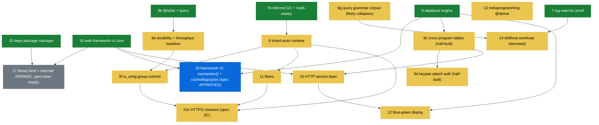
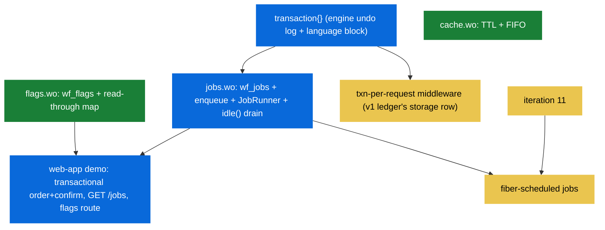

# Dependency graphs — iterations and framework features

> Companion to [00-status.md](00-status.md) (states live THERE; this page
> carries the edges). An arrow `A --> B` means **A must exist before B**.
> Use it to pick the next implementation: anything whose incoming arrows
> are all green is startable today. Updated 2026-08-20.

## 1. Story iterations

Hard dependencies only — edges that force order. The CHOSEN order among
startable nodes (9e before 8 so the restructure has a baseline; 9c/9d
before 10 goes 9c-first because 9d folds into 9c's plan) lives in
00-status.md's "Implementation order".

Reading it: **18 is the only spec-approved open node with all
prerequisites green** — it is the next implementation. After 18: 9c/9d
and 9e are startable in parallel-in-principle (order chosen: 9c/9d
first, half-built branches rot). 13 has no incoming edges but is
scope-directive-parked behind 12. 17 unparks whenever directed — its
prerequisites landed and its spec+plan sit on branch `library-internal`.

## 2. Framework v1 — remaining ledger items

What each open ledger row waits on. Three gates recur: **net seams**
(runtime `net` builtins), the **crypto fork** (the language has no
bitwise operators — hashes become C runtime builtins or bit ops land
first; brainstorm before the slice), and **runtime iterations 8/11**.

```mermaid
flowchart TD
    classDef gate fill:#8250df,color:#fff,stroke:none
    classDef ready fill:#1a7f37,color:#fff,stroke:none
    classDef blocked fill:#eac54f,color:#000,stroke:none

    READY["startable today, pure .wo"]:::ready
    CORS["CORS middleware"]:::ready
    SECH["security-headers middleware"]:::ready
    HOSTV["host validation"]:::ready
    STRICT["strict-parsing audit (dup/conflicting Content-Length)"]:::ready
    WILD["wildcard segments *rest"]:::ready
    PREC["specificity precedence"]:::blocked
    GROUPS["route groups"]:::ready
    CTX["req.ctx bag"]:::ready
    XFF["X-Forwarded-For/-Proto parsing"]:::ready
    ACCEPT["Accept-driven negotiation"]:::ready

    NETSEAM["GATE: net runtime seams (timeouts, unix socket, peer address)"]:::gate
    TMOUT["read/write/idle timeouts"]:::blocked
    UNIX["unix socket binding"]:::blocked
    PEERV["trusted-proxy PEER verification"]:::blocked

    CRYPTO["GATE: crypto fork — C builtins vs language bit ops (brainstorm)"]:::gate
    SHA["SHA-256/512, HMAC, CRC32"]:::blocked
    ETAG["ETag + conditional requests"]:::blocked
    COOKIE["signed cookies"]:::blocked
    CSRF["CSRF"]:::blocked
    SESS["session integrity"]:::blocked
    HOOKV["webhook verification"]:::blocked
    JWT["JWT HS256 (HARD STOP after)"]:::blocked

    RT811["GATE: iterations 8/11 (shards, fibers)"]:::gate
    STREAM["body streaming + backpressure"]:::blocked
    SRESP["streaming responses + commit point"]:::blocked
    CANCEL["per-request cancellation"]:::blocked
    PUBSUB["pub/sub + WebSockets"]:::blocked

    RADIX["radix-tree routing"]:::blocked
    I9E2["9e measures the linear scan"]:::gate

    WILD --> PREC
    NETSEAM --> TMOUT
    NETSEAM --> UNIX
    NETSEAM --> PEERV
    CRYPTO --> SHA
    SHA --> ETAG
    SHA --> COOKIE
    SHA --> CSRF
    SHA --> SESS
    SHA --> HOOKV
    SHA --> JWT
    RT811 --> STREAM
    RT811 --> SRESP
    RT811 --> CANCEL
    RT811 --> PUBSUB
    I9E2 --> RADIX
```

The green column (CORS, security headers, host validation, strict-parsing
audit, wildcards, route groups, `req.ctx`, XFF parsing, Accept
negotiation) needs nothing — each is a framework-v1 slice startable in
any order, gated by `just web-app`.

## 3. Framework v2 (iteration 18) — internal order

Cache and flags have no dependencies — they can land first as warm-up
slices; `transaction { }` is the critical path (the only engine +
language work), jobs compose on it, the demo and gate close it out.

## Maintenance rule

When an iteration or slice lands, update its node's class here in the
same change that moves the board row — the two documents answer
different questions (status vs. edges) and drift kills both.
