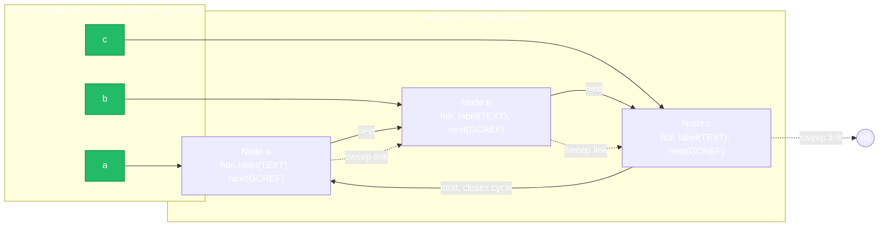
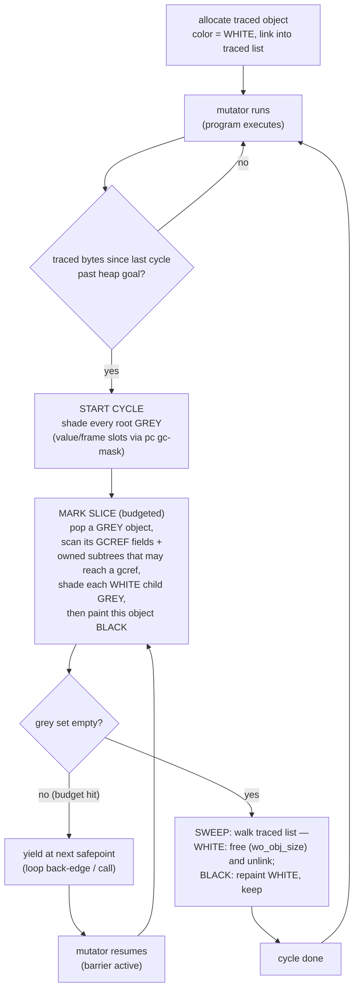
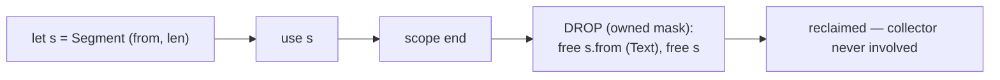

# gc-cycle — inferred GC + incremental mark-sweep, by example

The smallest program that needs a tracing collector (`ring_demo`) and the
smallest that does not (`owned_demo`). This README defines **how pointers/
addresses flow through the heap** and **the collector's mark-sweep logic**, the
way iteration 7b specs it
([`2026-08-11-inferred-gc-mark-sweep-design.md`](../../superpowers/specs/2026-08-11-inferred-gc-mark-sweep-design.md)).

The one-line model: **ownership frees everything it can; the collector traces
only the residue ownership cannot free — cycles and long-lived aliases — and
the compiler infers which types those are.**

---

## 1. Inference — the compiler decides `owned` vs `gc`

A pass between `types` and `owner` (`compiler/src/gcinfer.ml`) builds a
**class-reference graph** — an edge `A → B` whenever `A` has a field of type
`B`, `?B`, `multi B`, `map<B,_>`, or `map<_,B>`. **`ref B` creates no edge** (it
is a row id, `Copy`). Tarjan's SCC over that graph: any class in a non-trivial
SCC, or with a self-loop, is **traced (`gc`)**. Everything else is **`owned`**.

For this sample, `woc --dump-gc` would print:

```
Node       gc      (cycle Node -> Node)
Segment    owned
```

`Node.next: ?Node` is the self-loop → `Node` is traced, and its `next` field
gets kind `WO_K_GCREF`. `Segment` has no class-typed field → no edge → `owned`,
freed deterministically. A second, **demand** half promotes a type when the
ownership pass would otherwise report a long-lived-alias escape (the
`PriceCache` shape) — not exercised here; every promotion is reported, never
silent.

---

## 2. Address flow — where a pointer lives, and the object's shape

Every heap object is a 16-byte `wo_hdr` followed by `field_cnt` 8-byte slots
(`wo_fields(o)`; `wo_obj_size = 16 + field_cnt*8`). Allocation is the arena:
bump + 16-byte size-class free lists (16…1024), larger falls to `malloc`. **The
arena keeps no size headers and cannot enumerate objects** — so traced objects
thread an intrusive **sweep list**.

The header is where iteration 7b pays for the collector with **zero growth**:

```
        today (RC)                        under 7b (tracing)
  ┌──────────────────────────┐      ┌──────────────────────────┐
  │ class_id      (4 bytes)  │      │ class_id      (4 bytes)  │
  │ flags         (1) + pad  │      │ flags (1)  ── 2 color bits (white/grey/black), + pad
  │ borrow        (4 bytes)  │      │ sweep-list link (8 bytes)│  ← reclaimed from
  │ rc            (4 bytes)  │      │  (next traced object)    │     borrow + rc
  └──────────────────────────┘      └──────────────────────────┘
        16 bytes                           16 bytes  (unchanged)
```

`rc` is retired (no reference counting); traced objects are exempt from borrow
rules so `borrow` is dead too — the two adjacent 4-byte words become one 64-bit
list link. Color lives in 2 existing flag bits (`WO_F_COLOR`).

A traced pointer (the address of a `wo_hdr`) is only ever held in one of three
places, and these are exactly what the collector reads:

| Holder | How the collector sees it |
| --- | --- |
| a **VM value-stack / frame slot** (a local like `a`) | a **root**, via the per-pc **gc-mask** the emitter already emits |
| a **`GCREF` field slot** of another object (`a.next`) | followed during **mark** |
| a **container** item (`multi`/`map`) whose element kind is `GCREF` | followed during mark |

Here is the sample's heap after `ring_demo` builds the ring, while `a`/`b`/`c`
are still live roots:



Solid arrows are `GCREF` pointers the mark phase follows; the dotted chain is
the per-shard **traced list** the sweep phase walks (independent of
reachability). When `a`/`b`/`c` leave scope, the three solid *root* arrows
vanish — the ring still points to itself, but nothing points *in*, so it is
unreachable yet un-freed. Ownership cannot help: `b` cannot be owned by both
`let b` and `a.next`. That is the collector's entire job.

---

## 3. Mark-sweep logic — tri-color, incremental, with a deletion barrier

Marking runs in **budgeted slices** (`WO_GC_BUDGET` objects per slice), so the
pause is bounded regardless of heap size. Colors: **white** = unproven (candidate
to free), **grey** = reachable but children not yet scanned, **black** = reachable
and scanned.



**Roots.** The value stack and frame stack, read through the per-pc gc-mask the
emitter already produces (the drop-table's gc bits, reinterpreted from "rc_dec
these on unwind" to "these registers are GC roots at this pc"). No stack
scanning, no native frames — a bytecode VM with an explicit value stack has the
map for free.

**Owned objects are traversed, never freed.** An `owned` object can hold a
`GCREF` field, so mark must walk through owned subtrees to reach traced
objects — but it never frees an owned object (drop owns those). A precomputed
class-table bit, **"transitively contains a gcref"**, lets mark skip any owned
subtree that can reach no traced object at all.

**The barrier — why incremental is safe.** Between slices the mutator keeps
running and can hide a live object from a half-finished mark: store a white
object into an already-**black** object, then drop the original grey/white
reference to it. A **Yuasa deletion barrier** closes this: on any store into a
`GCREF` slot **while marking is active**, shade the slot's **old** value grey
before overwriting it. In the sample, `a.next = b` (and the ring-closing
`c.next = a`) go through the store paths `SETF`/`map_set`/`push` where the
barrier lives — no new opcode, because `SETF` already resolves the field kind
from the class table. Owned stores, scalars, and Text pay nothing. Reading a
shard's roots fresh from its masks each slice is what removes Go's Dijkstra
insertion-half and the stack rescan.

**Trigger & budget.** A cycle starts when the shard's traced bytes since the
last cycle cross a heap goal; each slice marks at most `WO_GC_BUDGET` objects;
`WO_GC_TRACE` prints freed/marked counts per slice. Collection is **per-shard**
— ownership moves mean no traced object spans shards, so there is no global
stop-the-world and no cross-shard tracing.

---

## 4. The owned path, for contrast (no collector at all)

`owned_demo` builds a `Segment`. At the closing `}` the drop table lists its
register in the **owned mask**; the VM frees the object and its `Text` field
deterministically and immediately. No color, no list link, no barrier, no
slice. This is the common case, and log-watcher proves it scales: 35 classes,
**zero** traced, arena + deterministic drops end to end.



So a `.wo` program has **two** reclamation systems working together: ownership
(deterministic, free, the 99%) and tracing (only the cyclic/aliased residue,
inferred). The developer writes no memory annotations for either.

---

## Run status

Iteration 7b is landing in phases (plan:
[`../../superpowers/plans/2026-08-18-inferred-gc-mark-sweep.md`](../../superpowers/plans/2026-08-18-inferred-gc-mark-sweep.md)).

**Phase 1 (landed).** The inference pass classifies each class; `woc --dump-gc
docs/examples/gc-cycle` prints:

```
Node       gc     (cycle Node -> Node)
Segment    owned
```

**Phase 2a (landed).** `Types.is_gc_class` is now inference-first, so `Node` is
traced with **no annotation** and *traced classes alias freely* — the ring
**compiles** (the old `WO-E301: use of \`a\` after it was moved` at `c.next = a`
is gone), and its bytecode is byte-identical to writing `@gc class Node`.

**Not yet: the ring runs.** On today's runtime (RC + Bacon–Rajan, `gc.c`) a
**nullable single-reference gc field** (`next: ?Node`) store/read is
unimplemented — even a one-hop `a.next = b; print(a.next.label)` traps
`null receiver` (the existing gc corpus only exercises `multi` gcref fields,
which do work). Running the ring, and reclaiming it, is **Phase 3**: the
incremental mark-sweep collector + full gcref field paths, the `.wob`
opcode-27/28 retirement, and the sweep list.

**Phase 2b (landed).** Demand promotion: the ownership pass, run in collect
mode, promotes any class whose value *must escape* (returned, stored where it
outlives its scope) — the acyclic-but-aliased case inference by structure cannot
see, targeting the escaping projection's type precisely. So GC-ness is fully
inferred: cycles by structure + aliasing by demand.

**`@gc` removed from the language (landed).** The keyword is now a hard error
(`WO-E104`): a developer never writes or mentions it; `woc --dump-gc` shows what
inference decided. WO-W201 (which suggested `@gc`) is retired. No `.wo` in the
repo carries `@gc`. This is the front-end half of iteration 7b, complete.

When 7b lands, the acceptance is:
- `woc --dump-gc docs/examples/gc-cycle` classifies `Node gc (cycle …)` /
  `Segment owned`.
- `ring_demo` prints `ring a -> b -> c -> a`, and after the roots die the ring
  is collected within budgeted slices (observable via `WO_GC_TRACE`), ASan-clean
  after repeated cycles.
- The adversarial barrier fixture (hide a node between slices) frees the node
  when the barrier is compiled out and keeps it when it is in.

Files: [`types.wo`](types.wo) (the two shapes), [`main.wo`](main.wo) (the two
demos), [`wo.toml`](wo.toml).
