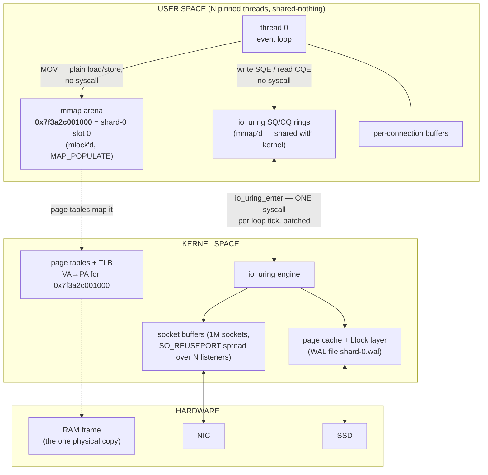
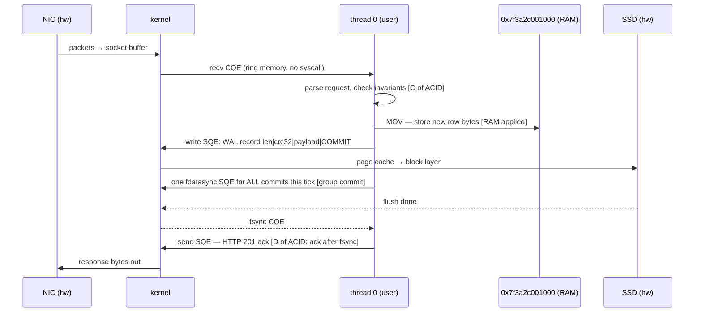

# wo-rt-c architecture — one memory address, two spaces, a million connections

This document defines the runtime's architecture by following **one memory address** through user space, kernel space, and hardware, under a million connections reading and writing it concurrently — then suggests improvements. Companion docs: [`00-plan.md`](./00-plan.md) (the phases that build this), [`README.md`](../../../../prototypes/wo-rt-c/README.md) (phase-0 module map).

## The cast: one address

The database is one `mmap` arena. After the 4 KB header page, shard 0's first row slot sits at:

```
row  =  arena + 4096          →  virtual address  0x7f3a2c001000   (say)
```

Three facts define everything that follows:

1. **User space sees a virtual address.** `0x7f3a2c001000` is an entry in this process's page tables; the kernel resolved it to one physical RAM frame at fault time (`MAP_POPULATE` faults it in at boot, before any request).
2. **The kernel pins the frame.** `mlock` guarantees the physical page is never swapped — a load from this address is always a RAM access, never disk I/O in disguise.
3. **Exactly one thread owns writes to it.** The address lies inside shard 0's slice; thread 0 is the only code in the process that may store to it ([00-plan.md decision 2](./00-plan.md)). Data exists once — ownership, not copying, is the concurrency model.

## The two spaces

User space and kernel space touch the same physical pages in exactly two places — the arena (data) and the io_uring rings (control). Everything else crosses by syscall.



The arrows worth staring at: the thread's access to the database (`MOV`) and to the I/O queues (ring writes) cross **no** boundary. The only recurring syscall is one batched `io_uring_enter` per loop tick.

## Write path — the address changes

One of the million connections POSTs a new value. Dual-write order per [00-plan.md decision 6](./00-plan.md): RAM first, then the hard drive, ack only after the disk confirms.



Boundary crossings per commit: amortized to **one** `io_uring_enter` shared by every commit in the tick — the store to the address itself costs zero. Atomicity lives in the WAL framing (a torn record fails CRC and is dropped whole on replay); isolation is thread 0's serial execution; durability is the ack ordering.

## Read path — the address is observed

```
GET /api/notes/0  →  thread 0 formats JSON straight from 0x7f3a2c001000
                  →  send SQE  →  socket buffer  →  NIC
```

The database read is **a memory load**. No file descriptor, no syscall, no kernel involvement until the response leaves. This is what "the whole database resides in RAM" buys: the kernel is in the room for networking and durability, not for reads.

## A million connections against this one address

- The kernel's `SO_REUSEPORT` hash spreads ~1M sockets across N listeners → each thread owns ~1M/N connections outright (accepts never migrate).
- **Memory ceiling:** ~8 KB user-space state per connection (`conns[]` buffer) + kernel sk_buffs → 1M connections ≈ 8 GB user + kernel-tunable socket memory. `RLIMIT_NOFILE` must be raised at boot (00-plan.md phase F).
- **Writes:** every write to the address funnels to thread 0 and serializes — that *is* the ACID isolation story, and group commit keeps the WAL from becoming a per-write fsync storm.
- **Reads — the honest bottleneck:** today a connection that hashed to thread 3 cannot serve the address; only shard 0's thread may touch it. One hot row = one core's worth of read throughput (~the per-core ceiling), while the other N−1 cores idle on that row. The improvements below exist for exactly this.

## Suggested improvements

Ordered by how cleanly each fits the locked doctrine (thread-per-core, no locks on the data path, no duplication, libc only).

### 1. Per-slot seqlock — every core may read the one address

The single highest-leverage change. Give each slot a version counter; the owning thread (still the **only writer**) increments it before and after the store (odd = mid-write). Any thread on any core may then read the address directly:

```c
do { v1 = atomic_load_acquire(&slot->ver);          /* spin only while odd */
     memcpy(local, slot->bytes, len);
     v2 = atomic_load_acquire(&slot->ver);
} while (v1 != v2 || (v1 & 1));
```

A hot row becomes readable by all N cores **with zero duplication — same physical frame, same address** — and writes stay serial, so ACID isolation is untouched. Cost: two atomic increments per write, a retry loop per read (C11 atomics, no library). Doctrine note: this relaxes "only the owner touches the slice" to "only the owner *writes* the slice"; contrast with [plan 13e's hot-row read replicas](../../13-class-model-live-pricing.md), which solve the same bottleneck by *copying* rows per thread — seqlock is the no-duplication answer the replica design isn't.

### 2. Registered buffers and files (`IORING_REGISTER_BUFFERS` / `_FILES`)

The arena and connection buffers are already `mlock`-pinned; registering them lets the kernel skip per-operation page lookup/refcounting, and WAL fds skip the fd-table walk. Pure win, no doctrine impact.

### 3. Zero-copy send (`IORING_OP_SEND_ZC`)

Responses currently copy user → socket buffer. Zero-copy send transmits straight from user memory — strongest when combined with improvement 5, where the hot row's bytes are already response-shaped.

### 4. SQPOLL (`IORING_SETUP_SQPOLL`)

A kernel-side poller consumes the SQ ring; steady state needs **zero** syscalls — even the per-tick `io_uring_enter` disappears. This is precisely the "the only non-userland thread is the kernel-owned io_uring SQPOLL helper" end state already written into the project's concurrency model (CLAUDE.md). Cost: one kernel thread per ring burning a core fraction; enable per-deployment.

### 5. Serialized-row cache beside the slot

Store the rendered JSON next to the row bytes, invalidated by the same seqlock version bump. A hot read becomes `memcpy` from the address — no formatting per request. Trades arena bytes for CPU; measurable in phase F before adopting.

### 6. NUMA-aware arena placement (`set_mempolicy` / `mbind`)

On multi-socket boxes, bind each shard slice's pages to the owning core's NUMA node — the address is always a local-node load (~80 ns vs ~140 ns remote). No-op on single-socket dev machines; matters at the 16-core scale-out target.

### 7. Multishot recv + huge pages

`IORING_RECV_MULTISHOT` arms one SQE per connection instead of one per request — at 1M connections that is the difference between 1M and ~0 re-arm submissions per tick. `MAP_HUGETLB` (already phase B) cuts TLB pressure: a 16 GB arena is 8.4M × 4 KB entries but only 8K × 2 MB entries.

### Deliberately not suggested

Work stealing (breaks single-writer ACID), shared-heap locking (the doctrine exists to avoid it — and at 1M readers a mutex on the row would serialize everything the seqlock parallelizes), liburing (the prototype's value is the raw syscall sequence), and multi-node distribution (plan 09's single-box stance). See [plan 09 § Non-scope](../../09-concurrency-scaleout.md).

## Cross-references

- [`00-plan.md`](./00-plan.md) — phases A–F that build the architecture described here; improvements 1–7 slot into phases C/F or follow them.
- [`../../docs/plan/09-concurrency-scaleout.md`](../../09-concurrency-scaleout.md) — the thread-per-core doctrine.
- [`../../docs/plan/exploration/linux/07-io_uring.md`](../linux/07-io_uring.md), [`08-mmap.md`](../linux/08-mmap.md) — the two shared-page mechanisms.
- [`../../docs/plan/13-class-model-live-pricing.md`](../../13-class-model-live-pricing.md) — 13e's read-replica alternative, contrasted in improvement 1.
- [`../../docs/writeonce-pl.md`](../../../writeonce-pl.md) — the C/assembly "one address" pedagogy this doc extends to a full runtime.
