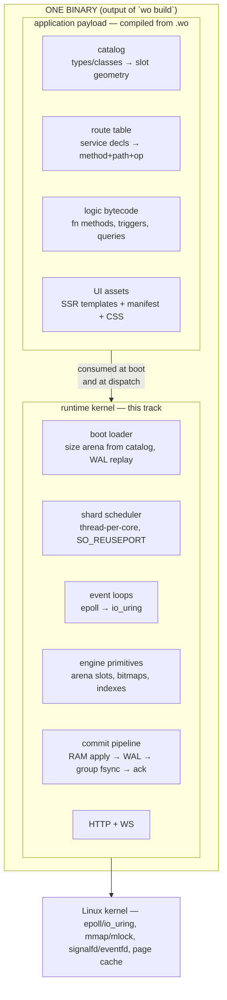

# 02 — The end goal: the writeonce single binary on this runtime environment

**Context sources:** [`00-plan.md`](./00-plan.md) (the runtime-environment phases, A–B ✅), [`01-architecture.md`](./01-architecture.md) (the one-address trace), [`../../../runtime/wo-language.md`](../../../runtime/wo-language.md) ("one binary per project; no runtime to install on the target host"; `.wo` has "its own lexer, parser, analyzer, and bytecode"), [`../../09-concurrency-scaleout.md`](../../09-concurrency-scaleout.md)–[`12`](../../12-engine-disk-cutover.md) (the Rust product track this proves out), [`../../../runtime/database/02-wo-language.md`](../../../runtime/database/02-wo-language.md) (catalog + transaction semantics the payload carries).

## The end goal, stated once

> A developer writes `.wo` files. `wo build` emits **one static binary**. That binary **is** the runtime environment described in this track — thread-per-core shards, the mlock'd RAM arena, io_uring event loops, WAL dual-write, boot-time recovery — with the application **inside it** as data and bytecode. Deploy = copy one file to a Linux host. Nothing to install; the only "VM" underneath is the Linux kernel.

This resolves the phrase "runs **in** this runtime environment": writeonce is the **Go model, not the JVM model**. The environment is not a process you start and feed programs to — it is a **runtime kernel** statically linked into every application binary. What `wo-rt-c` builds phase by phase is that kernel, proven in C, ported to Rust per plans 09–12.

## The embedding contract

The seam between the two halves is narrow and data-shaped — the compiler emits **tables**, the kernel consumes them. Five entries:

| Payload artifact | Emitted from | Consumed by | Exists today as |
| --- | --- | --- | --- |
| **Catalog** — per type/class: field layout, slot size, unique keys, shard key | `type`/`class` decls (`crates/rt/src/compile.rs`) | boot loader: arena geometry (`arena_hdr` is its miniature); engine: row codecs | `rt::compile::Catalog`, built per `wo run` |
| **Route table** — `(method, path pattern, operation, type id)` | `service` blocks | HTTP dispatch | `rt::server::router` |
| **Logic bytecode** — method/trigger/query programs | `fn` bodies, `on` blocks, schema-layer DML | a bytecode interpreter running **inside the owning shard's thread** — serial execution = ACID isolation for free | parse-and-discard (13b lands the executor) |
| **UI assets** — SSR templates, manifest, flattened CSS, `wo-runtime.js` | `##ui` triplets (plan 14) | HTTP static + SSR renderer | design (plans 13d/14) |
| **App manifest** — name, version, default port/threads | `wo.toml` | boot banner, env-var defaults | `wo.toml` parsing TBD |

Two consequences worth locking:

1. **The shard key comes from the catalog, not the kernel.** `wo-rt-c` hashes connections (4-tuple) because it has no catalog; the product routes *operations* by the catalog's shard key (plan 09 decision 5: customer id, author id) — a request landing on any thread sends an in-process message to the owning shard. Phase A's `SO_REUSEPORT` spread is the transport layer of that story, not the final routing.
2. **Bytecode runs where the data lives.** A `set_price` method executes on the shard that owns the product row — the interpreter is invoked from the event loop, runs to completion, commits through the WAL pipeline. No cross-thread data access; cross-shard transactions escalate to 2PC (plan 09e).

## Boot sequence of the single binary

What `./myapp` does before serving — each step already prototyped or phased:

| # | Step | Proven by |
| --- | --- | --- |
| 1 | Read embedded catalog → compute arena geometry (shards × slot families) | `arena_hdr` (phase B ✅) |
| 2 | `mmap` + `MAP_POPULATE` + `mlock` the arena (hugepages, 4 K fallback) | phase B ✅ |
| 3 | Replay per-shard WAL/snapshot from disk into the arena, in parallel | phase E |
| 4 | Spawn `WO_THREADS` pinned shard threads, each with ring + `SO_REUSEPORT` listener | phase A ✅ / phase C |
| 5 | Install route table + bytecode programs per shard | 13b / this contract |
| 6 | Listeners open; signalfd→eventfd shutdown armed | phase A ✅ |

Steps 1–2 and 4–6 exist in `wo-rt-c` today with the notes store standing in for the catalog. The end state swaps the hard-coded `slot_note` for catalog-driven slot families — the kernel code does not otherwise change shape.

## What runs where — `.wo` construct → runtime home

| `.wo` construct | At runtime, inside the binary |
| --- | --- |
| `type` / `class` fields | a slot family in each shard's arena slice |
| `class` `fn` methods | bytecode executed serially in the owning shard's thread (`POST /api/<t>/:id/<m>`) |
| `service rest … expose` | route-table entries dispatched by the HTTP layer |
| `on <event>` triggers | bytecode hooked into the commit pipeline, same transaction |
| `LIVE select` / `subscribe` | per-shard subscription registry; deltas fan out one message per shard (09d) |
| `##ui` screens | SSR render + manifest at GET routes; live patches ride the same deltas |
| `policy` rules | predicate rewrites applied before the engine touches slots |
| `main { … }` | bytecode run once at boot step 5½, before listeners open |

## Division of labor (locked by the C-vs-Rust decision)

- **`wo-rt-c` (C)** — proves each kernel syscall sequence first: threads/arena (✅), io_uring, WAL, recovery, bench. It will never parse `.wo`; its notes store is the stand-in payload.
- **`crates/rt` (Rust)** — the product: owns the compiler front-end today (lexer→catalog, Stage 2 shipped) and absorbs each proven kernel sequence per plans 09–12, where ownership makes the shard discipline a compile-time guarantee.
- **Optional phase G** (named in [`00-plan.md`](./00-plan.md)): splice the [`wo-db`](../../../../prototypes/wo-db/) C++ query engine onto `wo-rt-c` as an end-to-end C-family demonstrator of this document — valuable as proof, never the product.

## Cross-references

- [`00-plan.md`](./00-plan.md) — the kernel phases; [`01-architecture.md`](./01-architecture.md) — the one-address trace through the same stack.
- [`../../../runtime/wo-language.md`](../../../runtime/wo-language.md) — the user-facing single-binary promise this document implements.
- [`../../13-class-model-live-pricing.md`](../../13-class-model-live-pricing.md) (13b methods), [`../../14-mvc-ui-implementation.md`](../../14-mvc-ui-implementation.md) (UI assets) — the payload-side tracks.
- [`../../09-concurrency-scaleout.md`](../../09-concurrency-scaleout.md) — shard-key routing and 2PC the contract defers to.
